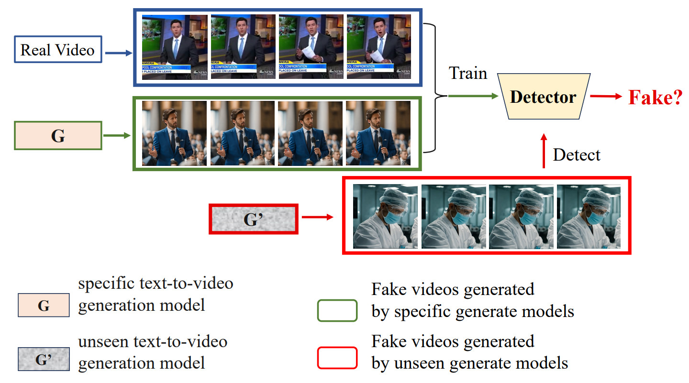

# DeCoF: Generated Video Detection via Frame Consistency
  
## News 🚀
**[2024/1/31]**  Comming soon.    

**[2024/6/7]**  The prompts used to generate videos, the attribute partitioning involved in prompts, and the partitioning of the dataset  have been open-source. You can access it in the `/datas/` folder. Unfortunately, we are unable to directly provide real videos. You can download them from the original dataset based on the video_id of prompts.  

**[2024/6/16]**  All generated videos can be downloaded from [here](https://pan.baidu.com/s/1j725GWEB2lsGtuUy4Rvl3g?pwd=ptr8) (**ptr8**), The emergence speed of video generation models far exceeds our imagination. If you expand a subset based on our dataset, we sincerely invite you to release the corresponding generated videos.

**[2024/7.1]** Thanks to [Kling](https://kling.kuaishou.com/). We have extended the DecoF dataset based on the video generation model **Kling**, and the test dataset for Kling will be made public soon.


## Abstract
> The escalating quality of video generated by advanced video generation methods results in new security challenges, while there have been few relevant research efforts: 1) There is no open-source dataset for generated video detection, 2) No generated video detection method has been proposed so far.
To this end, we propose an open-source dataset and a detection method for generated video for the first time. 
First, we propose a scalable dataset consisting of 964 prompts, covering various forgery targets, scenes, behaviors, and actions, as well as various generation models with different architectures and generation methods, including the most popular commercial models like OpenAI's Sora and Google's Veo.
Second, we found via probing experiments that spatial artifact-based detectors lack generalizability. Hence, we propose a simple yet effective detection model based on frame consistency (DeCoF), which focuses on temporal artifacts by eliminating the impact of spatial artifacts during feature learning.

<p align="center">

</p>

## Generated video detection
**We hope that our work can assist future researchers. Here we showcase the work of other researchers in generated video detection.**
* DeCoF: Generated Video Detection via Frame Consistency,  **2024.2**: [paper](https://arxiv.org/abs/2402.02085)

   **method**
   <p align="center">
    
    </p>
   
* DeMamba: AI-Generated Video Detection on Million-Scale GenVideo Benchmark, **2024.5** [paper](https://arxiv.org/abs/2405.19707)
  
  **method**
   <p align="center">
     
    </p>

## Overview
- **[GeneratedVideoForensics (GVF) dataset.]**
- **[DeCoF.]**
## GeneratedVideoForensics (GVF) dataset.

<p align="center">

</p>

## DeCoF.

<p align="center">

</p>

# Citation
If you find our work useful for your research, please consider citing our paper:
```bibtex
@article{ma2024decof,
  title={DeCoF: Generated Video Detection via Frame Consistency},
  author={Ma, Long and Zhang, Jiajia and Deng, Hongping and Zhang, Ningyu and Liao, Yong and Yu, Haiyang and Zhou, Pengyuan},
  journal={arXiv preprint arXiv:2402.02085},
  year={2024}
}
```
