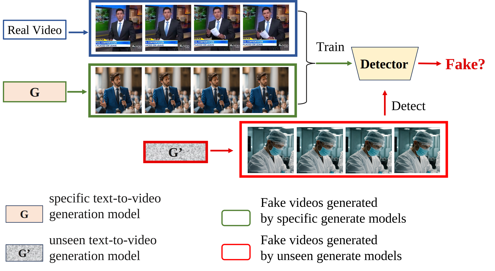

# DeCoF: Generated Video Detection via Frame Consistency
## News 🚀
**[2024/1/31]** Comming soon.    
## Abstract
> The escalating quality of video generated by advanced video generation methods leads to new security challenges in society, which makes generated video detection an urgent research priority. To foster collaborative research in this area,we construct the first open-source dataset explicitly for generated video detection, providing a valuable resource for the community to benchmark and improve detection methodologies. Through a series of carefully designed probe experiments,our study explores the significance of temporal and spatial artifacts in developing general and robust detectors for generated video. Based on the principle of video frame consistency, we introduce a simple yet effective detection model (DeCoF) that eliminates the impact of spatial artifacts during generalizing feature learning. Our extensive experiments demonstrate the efficacy of DeCoF in detecting videos produced by unseen video generation models and confirm its powerful generalization capabilities across several commercial proprietary models.

## Overview
- [GeneratedVideoForensics (GVF) dataset.]
- [DeCoF.]
## GeneratedVideoForensics (GVF) dataset.

## DeCoF.

