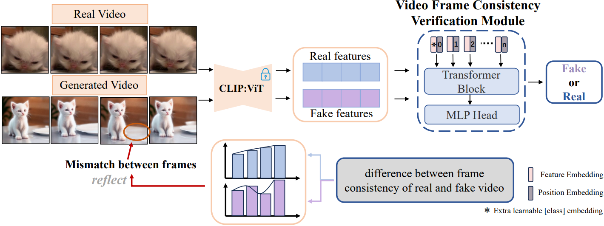

# DeCoF: Generated Video Detection via Frame Consistency

    

  

## News 🚀
**[2025.4.16]** Our paper has been accepted by ICME 2025. 🎉🎉🎉 

**[2025.4.16]** The training code and weights have been open-source.

**[2024/6/7]**  The prompts used to generate videos, the attribute partitioning involved in prompts, and the partitioning of the dataset  have been open-source. You can access it in the `/datas/` folder. Unfortunately, we are unable to directly provide real videos. You can download them from the original dataset based on the video_id of prompts.  

**[2024/6/16]**  All generated videos can be downloaded from [here](https://drive.google.com/drive/folders/1X4Gw4hkWfka42IaBQ6ImkDTGAeA9Wlk4?usp=drive_link), The emergence speed of video generation models far exceeds our imagination. If you expand a subset based on our dataset, we sincerely invite you to release the corresponding generated videos.

**[2024/7.1]** Thanks to [Kling](https://kling.kuaishou.com/). We have extended the DecoF dataset based on the video generation model **Kling**, and the test dataset for Kling will be made public soon.

## Abstract
> The increasing realism of AI-generated videos has raised potential security concerns, making it difficult for humans to distinguish them from the naked eye. Despite these concerns, limited research has been dedicated to detecting such videos effectively.
To this end, we propose an open-source AI-generated video detection dataset. Our dataset spans diverse objects, scenes, behaviors, and actions by organizing input prompts into independent dimensions. 
It also includes various generation models with different generative models, featuring popular commercial models such as OpenAI's Sora, Google's Veo, and Kwai's Kling.
Furthermore,  we propose a simple yet effective **De**tection model based on **Co**ncistency of **F**rame (DeCoF), which learns robust temporal artifacts across different generation methods.
Extensive experiments demonstrate the generality and efficacy of the proposed DeCoF in detecting AI-generated videos, including those from nowadays' mainstream commercial generators.

## Code
>we provide our model weights [here](https://drive.google.com/drive/folders/1X4Gw4hkWfka42IaBQ6ImkDTGAeA9Wlk4?usp=drive_link). The training code is in src.

# Citation
If you find our work useful for your research, please consider citing our paper
